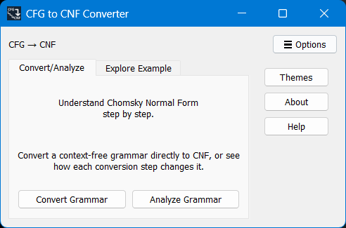
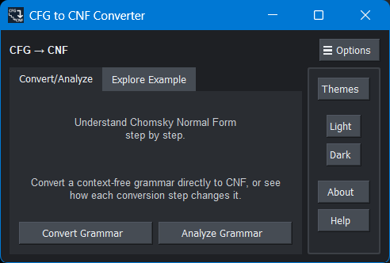
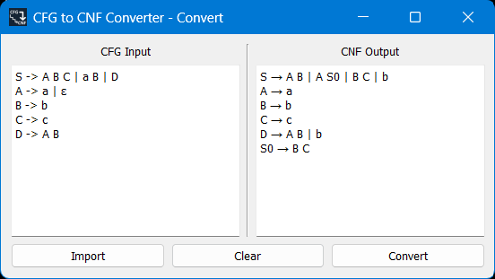
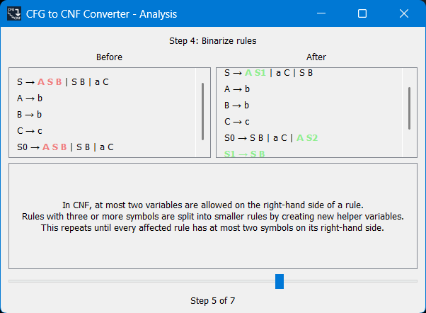

# CFG to CNF Converter

An educational application made with PyQt5 in Python that can both convert a context-free grammar (CFG) directly to Chomsky Normal Form (CNF) and analyze the conversion by showing the transformations happening at each step.

## Features

- Convert mode for immediate conversion
- Analyze mode for showing each transformation step
- Comparison of intermediate grammars before and after each change
- Highlights showing what gets removed or added at each step
- Explanations of each conversion step
- Example grammar available for analysis
- `.txt` grammar text import ability
- Light and dark themes
- Help page explaining accepted and prefered input forms

## Grammar Input Format

- Start variable must **always** be `S`.
- One variable and all of its productions on one line is preferred.
- Productions are separated by `|`. However, `∣`, `│`, `┃`, and `¦` are also accepted as separators.
- Symbols **must** be separated by whitespace.
- Any of the two `→` or `->` are accepted as arrows.
- `ε` is used to represent epsilon. However, you can also type `λ`, `eps`, or `epsilon`.
- Terminals can only be lowercase English letters or `ε`. 

Below is an example of a preferred input format:

```text
S -> A B | a
A -> a
B -> b
```

### Variable Formats 

Variables must **always** begin with an uppercase English letter. Below are the accepted formats with examples:

- Single uppercase letter: `A`, `B`, `S`
- Uppercase first letter followed by lowercase letters: `Start`, `Variable`, `Abc`
- Uppercase followed by apostrophes: `A'`, `A''`, `Start'`
- Uppercase followed by an underscore, then lowercase letters only: `A_name`, `B_var`
- Uppercase followed by an underscore, then digits only: `A_1`, `Var_12`, `Name_123`
- All uppercase letters: `AB`, `ABC`, `XYZ`
- Uppercase followed by digits only: `A0`, `A12`, `B123`

Examples below are **not** valid variable formats:

- `A_123B`
- `A_123b`
- `A0D`
- `A0d`

## Conversion Pipeline

1. Normalizing start symbol
2. Removing ε-rules
3. Removing unit rules
4. Binarization
5. Replacing terminals

## Running from Source

### Requirements

- Python
- PyQt5

### Setup

1. Clone repository
2. Install PyQt5 if not already installed
3. Run the following command from the root folder (`cfg-to-cnf-converter`):
```bash
python main.py
```

## Standalone Windows Executable

If you use windows and do not want to run the program from source, a standalone `.exe` file is available under the repository's **Releases** section, which allows you to run the program without installing Python or PyQt5.

## Project Structure

- `backend/`: Contains parsing and conversion logic
- `gui/`: Is the PyQt5-based GUI interface
- `styles/`: Contains `dark.css`, the application's stylesheet
- `assets/`: Contains the application's icon
- `main.py`: Application's entry point

## Educational Purpose

This project was created not to be merely a CFG to CNF converter, but also to show the transformations happening to the grammar at each step, making it easier for users to understand the process. 

## Screenshots

### Main Window - Light Theme



### Main Window - Dark Theme



### Convert Mode



### Analyze Mode

